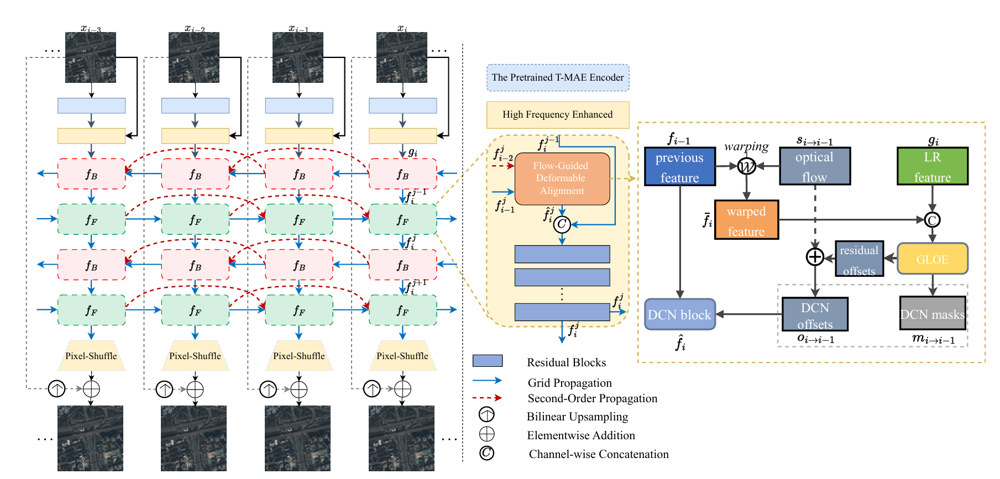
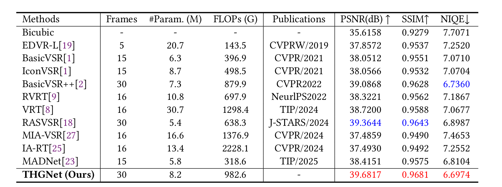
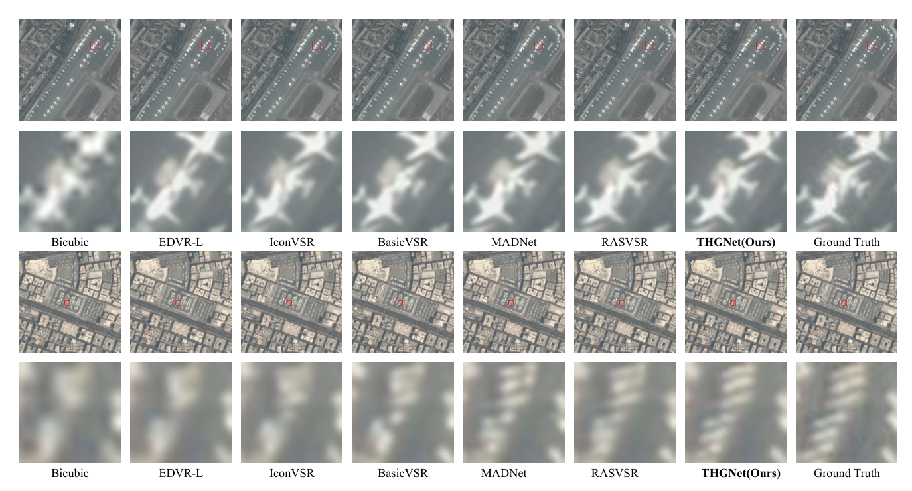

# THGNet


## Abstract
<!--While foundation models pretrained on large-scale natural images have revolutionized many multimedia tasks, their effectiveness often diminishes when applied to domain-specific multimedia data with unique characteristics, such as remote sensing videos. This domain shift poses a significant challenge for generative restoration tasks like video super-resolution, which is crucial for bandwidth-efficient transmission and high-level analysis of geospatial multimedia. To bridge this gap, we propose THGNet, a novel framework that integrates domain-adaptive foundation model pretraining into a coarse-to-fine VSR pipeline. Specifically, we propose a temporal masked autoencoder to learn transferable spatiotemporal priors directly from remote sensing sequences, providing a robust feature foundation. A global-local offsets estimator is designed to enhance cross-frame alignment under complex satellite motions. Furthermore, a lightweight high-frequency enhancement module injects detail cues to counteract information loss during propagation. We also construct and release the CQ1-VSR dataset, comprising unregistered raw satellite videos with significant inter-frame variations, presenting a more realistic and challenging benchmark. Experimental results show that THGNet achieves state-of-the-art performance, e.g., 39.68 dB PSNR on SAT-MAT-VSR with only 8.2M parameters. Code, models, and dataset will be released after acceptance.
-->
## Network  


## Environment

- Python 3.8+
- PyTorch 2.0+
- CUDA 11.8+
- Linux recommended

Please adjust the environment according to your hardware and dependency versions.

## Dataset
### SAT-MTB-VSR
SAT-MTB-VSR is a large-scale dataset for satellite video super-resolution made from original videos of Jilin-1, which is a subset of the satellite video multitasking dataset SAT-MTB.It contains 431 videos, each of which is 100 consecutive frames, of which 413 are used as the training set and 18 as the validation set, and all the 18 validation sets are from different original videos, while the size of the images is 640 × 640. These images are downsampled 4× by bicubic interpolation to get 160 × 160 low-resolution images, thus obtaining the LR-HR training pairs.

### CQ1-VSR
Compared with SAT-MAT-VSR, CQ1-VSR is more challenging because it is constructed from unprocessed raw remote sensing video sequences, which exhibit larger inter-frame variations. Since the original data are stored in the Bayer pattern format, we first
convert them into RGB images. To better simulate realistic degrada-
tions in remote sensing videos, we further apply noise corruption
and blur degradation during data preprocessing.After preprocess-
ing, the dataset is split into 150 training sequences, 26 validation
sequences, and 22 testing sequences. Each high-resolution frame
is cropped to a spatial size of 640 × 640, and the corresponding
low-resolution input is generated by ×4 downsampling, resulting
in LR frames of size 160 × 160.

### Dataset Download

Please download the datasets from the corresponding links and organize them as follows:

```bash
data/
├── SAT-MTB-VSR/
│   ├── train/
│   │   ├── GT/
│   │   └── LR4x/
│   └── val/
├── CQ1-VSR/
│   ├── train/
│   │   ├── GT/
│   │   └── LR4x/
│   ├── val/
│   └── test/
```

> Replace the folder names above with your actual dataset structure if it is different from this example.

## Directory Structure

A recommended project structure is as follows:

```bash
THGNet/
├── basicsr/
├── data/
├── experiments/
│   ├── pretrained_models/
│   └── ...
├── options/
│   ├── train/
│   │       └── train_THGNet.yml
│   └── test/
│           └── test_THGNet.yml
├── scripts/
├── README.md
├── requirements.txt
└── setup.py
```
## Install
1. Download the THGNet.zip

2. Install dependent packages

    ```bash
    cd THGNet
    pip install -r requirements.txt
    ```

3. Install BasicSR<br>
    Please run the following command in the root path of the project to install BasicSR:<br>

    ```bash
    python setup.py develop
    ```
   

## Pretrained Models
1. SAT-MAT-VSR  

    ```bash
    weights:  "\THGNet\experiments\pretrained_models\net_g_67000.pth"
    T-MAE Encoder: "\THGNet\experiments\pretrained_models\best_encoder_SMV.pth" 
    ```
2. CQ1-VSR   
    ```bash 
    weights:  "\THGNet\experiments\pretrained_models\net_g_83000.pth"
    T-MAE Encoder: "\THGNet\experiments\pretrained_models\best_encoder_CQ1-VSR.pth" 
    ```

## Training
- Single GPU
    ```
    python basicsr/train.py -opt options/train_THGNet.yml
    ```
- Multiple GPU
    ```
    CUDA_VISIBLE_DEVICES=0,1 torchrun --nproc_per_node=2 --master_port=29500 /path/to/basicsr/train.py -opt options/train_THGNet.yml --launcher pytorch 
    ```

## Test
- Single GPU
    ```
    python basicsr/test.py -opt options/test_THGNet.yml
    ```

## Results
### Quantitative Results



### Qualitative Results



## Explanation
Due to size limitations, the dataset and some weight files will be made public on GitHub later.

## Acknowledgement
This work is built upon [BasicSR](https://github.com/XPixelGroup/BasicSR).
