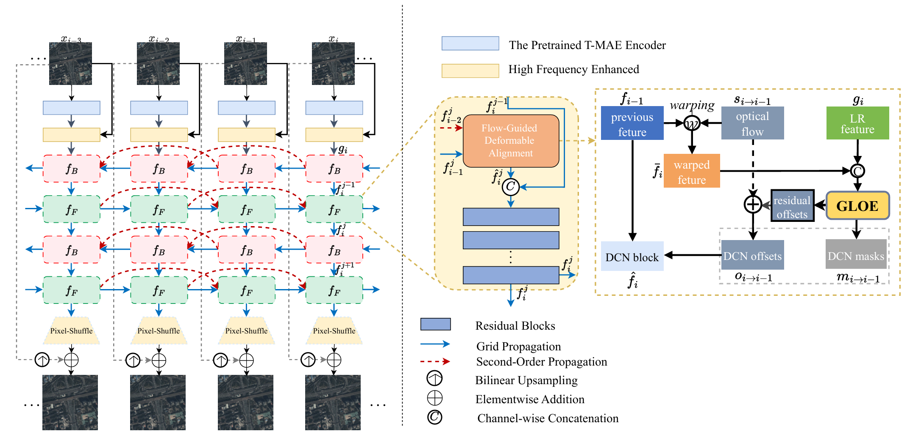
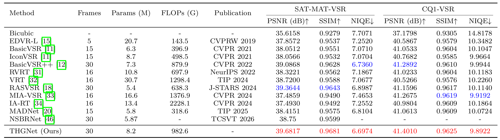
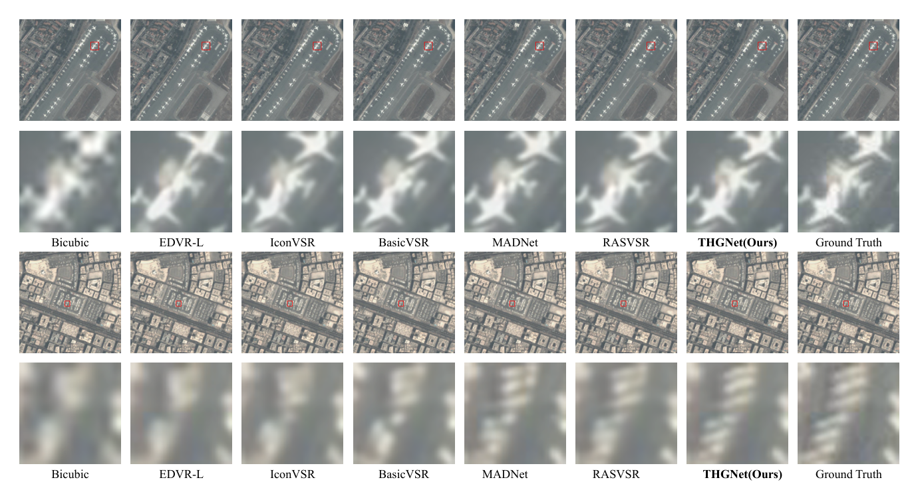
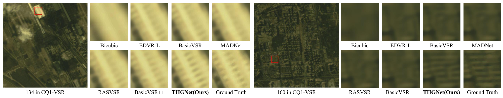

# THGNet

[📖 Paper](assets/THGNet.pdf) | [📄 PDF](assets/THGNet.pdf)

Official PyTorch implementation of **THGNet: Improving Temporal Alignment and Feature Representation for Remote Sensing Video Super-Resolution**.

This paper has been submitted to **IEEE Transactions on Geoscience and Remote Sensing (IEEE TGRS)**.

## Abstract
Remote sensing video super-resolution recon
structs high-resolution satellite video sequences from low
resolution observations. A central difficulty of this task is
temporal alignment: satellite videos often contain platform
induced frame-level displacement, residual jitter, weak tex
tures, and local structural variations, so useful cross-frame
information can be blurred or misaggregated when alignment
is inaccurate. This paper presents THGNet, a remote sens
ing VSR framework built on a recurrent backbone. Its key
component is the Global-Local Offsets Estimator (GLOE),
which refines second-order deformable alignment through com
plementary global-context recalibration and multi-scale local
offset refinement. To support this alignment-centered design, an
MAE-inspired temporal feature-masking pretraining strategy
(T-MAE) provides a context-sensitive encoder initialization,
and the High-Frequency Enhancement (HFE) module injects
gated high-pass cues before temporal propagation. We also
construct CQ1-VSR from raw unregistered satellite source
videos to complement preprocessed benchmarks with stronger
inter-frame variation. Under the reported comparison settings,
THGNet achieves the best performance among the compared
methods, reaching 39.68 dB PSNR on SAT-MAT-VSR and
41.40 dB on CQ1-VSR with 8.2M parameters.

## Network  


## Environment

- Python 3.8+
- PyTorch 2.0+
- CUDA 11.8+
- Linux recommended

Please adjust the environment according to your hardware and dependency versions.

## Datasets

### SAT-MTB-VSR

SAT-MTB-VSR is constructed from Jilin-1 satellite videos and contains 431 clips, including 413 training clips and 18 validation clips. Each clip consists of 100 consecutive frames. The high-resolution (HR) frames have a spatial resolution of 640 × 640, while the corresponding low-resolution (LR) frames are generated using ×4 bicubic downsampling. This dataset serves as the main benchmark for comparison with existing remote sensing video super-resolution methods.

| Split | Clips | Frames per clip | HR size | LR size | Scale |
|:---|---:|---:|:---:|:---:|:---:|
| Training | 413 | 100 | 640 × 640 | 160 × 160 | ×4 |
| Validation | 18 | 100 | 640 × 640 | 160 × 160 | ×4 |

### CQ1-VSR

CQ1-VSR is constructed from raw remote sensing video sequences captured by the QK-1 satellite. The original Bayer-pattern data are first converted into RGB images. The LR inputs are then generated using a clip-consistent ×4 synthetic degradation pipeline adapted from Real-ESRGAN, with blur degradation and noise corruption applied during preprocessing.

CQ1-VSR is therefore a raw-source dataset with synthetically generated LR–HR pairs rather than physically captured paired LR and HR videos. It contains 150 training sequences, 26 validation sequences, and 22 testing sequences. Each HR frame is cropped to 640 × 640, and its corresponding LR frame has a spatial resolution of 160 × 160. The dataset covers diverse scenes, including urban areas, airports, coastal regions, and farmlands.

| Split | Sequences | HR size | LR size | Scale |
|:---|---:|:---:|:---:|:---:|
| Training | 150 | 640 × 640 | 160 × 160 | ×4 |
| Validation | 26 | 640 × 640 | 160 × 160 | ×4 |
| Testing | 22 | 640 × 640 | 160 × 160 | ×4 |

### Dataset Preparation

Download the datasets and organize them using the following directory structure:

```text
data/
├── SAT-MTB-VSR/
│   ├── train/
│   │   ├── GT/
│   │   └── LR4x/
│   └── val/
│       ├── GT/
│       └── LR4x/
└── CQ1-VSR/
    ├── train/
    │   ├── GT/
    │   └── LR4x/
    ├── val/
    │   ├── GT/
    │   └── LR4x/
    └── test/
        ├── GT/
        └── LR4x/
```

> Adjust the folder names if your local dataset layout differs from the structure above.

## Directory Structure

A recommended project structure is as follows:

```bash
THGNet/
├── basicsr/
├── data/
├── experiments/
│   ├── pretrained_models/
│   └── ...
├── options/
│   ├── train/
│   │       └── train_THGNet.yml
│   └── test/
│           └── test_THGNet.yml
├── scripts/
├── README.md
├── requirements.txt
└── setup.py
```
## Install
1. Clone the code

    ```bash
    git clone https://github.com/HIAS-Zhao/THGNet.git
    ```

2. Install dependent packages

    ```bash
    cd THGNet
    pip install -r requirements.txt
    ```

3. Install BasicSR<br>
    Please run the following command in the root path of the project to install BasicSR:<br>

    ```bash
    python setup.py develop
    ```
   

## Pretrained Models
1. SAT-MAT-VSR  

    ```bash
    weights:  "\THGNet\experiments\pretrained_models\net_g_67000.pth"
    T-MAE Encoder: "\THGNet\experiments\pretrained_models\best_encoder_SMV.pth" 
    ```
2. CQ1-VSR   
    ```bash 
    weights:  "\THGNet\experiments\pretrained_models\net_g_83000.pth"
    T-MAE Encoder: "\THGNet\experiments\pretrained_models\best_encoder_CQ1-VSR.pth" 
    ```

## Training
- Single GPU
    ```
    python basicsr/train.py -opt options/train_THGNet.yml
    ```
- Multiple GPU
    ```
    CUDA_VISIBLE_DEVICES=0,1 torchrun --nproc_per_node=2 --master_port=29500 /path/to/basicsr/train.py -opt options/train_THGNet.yml --launcher pytorch 
    ```

## Test
- Single GPU
    ```
    python basicsr/test.py -opt options/test_THGNet.yml
    ```

## Results
### Quantitative Results


### Qualitative Results
#### SAT-MAT-VSR

#### CQ1-VSR


## Explanation
Due to size limitations, the dataset and some weight files will be made public on GitHub later.

## Acknowledgement
This work is built upon [BasicSR](https://github.com/XPixelGroup/BasicSR).
